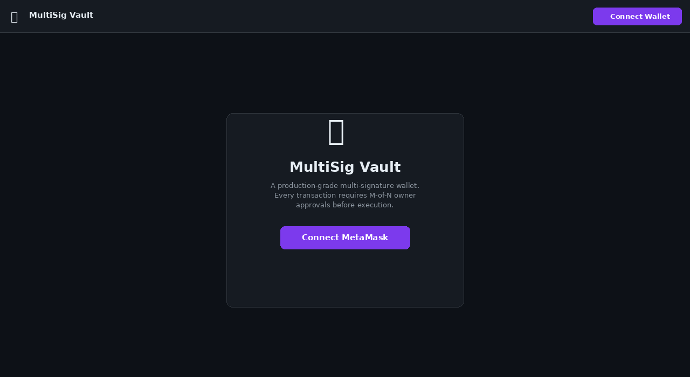
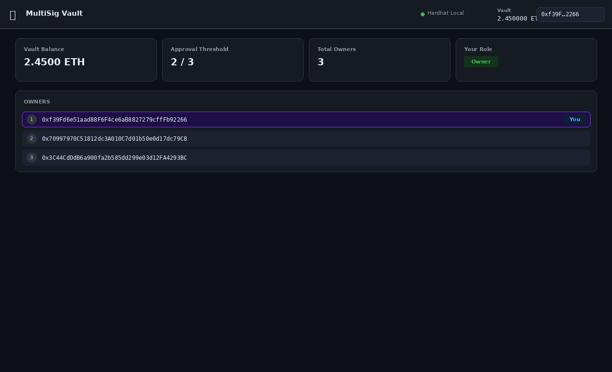
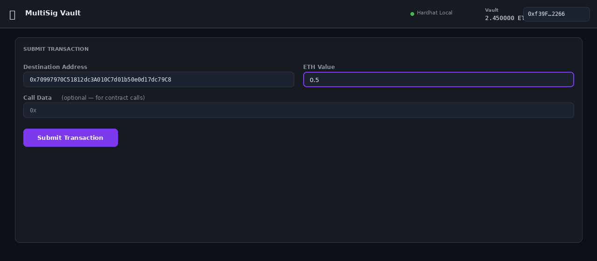
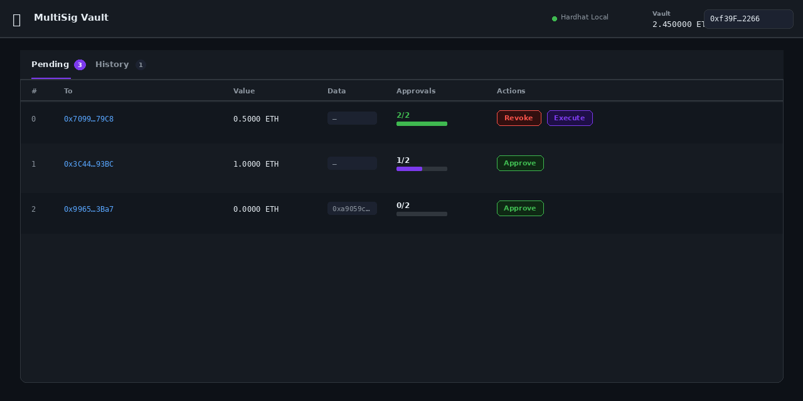
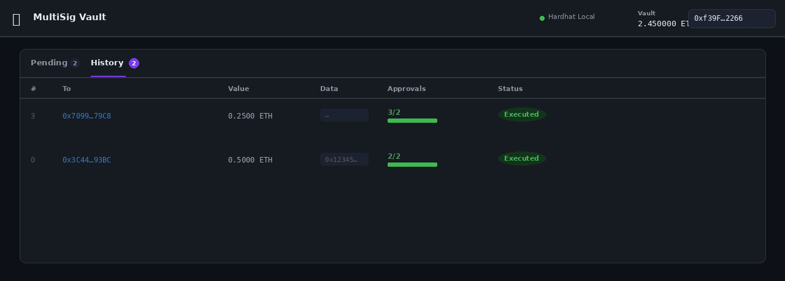
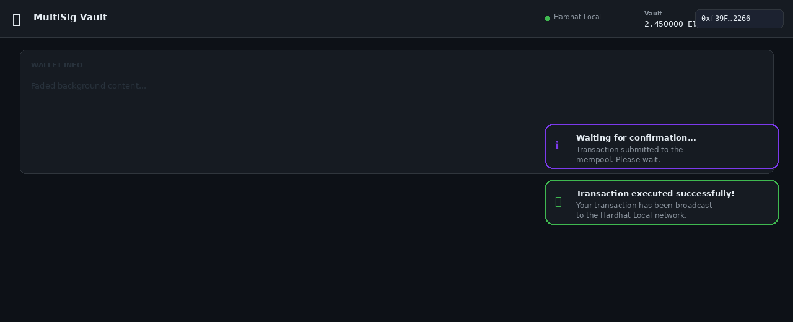
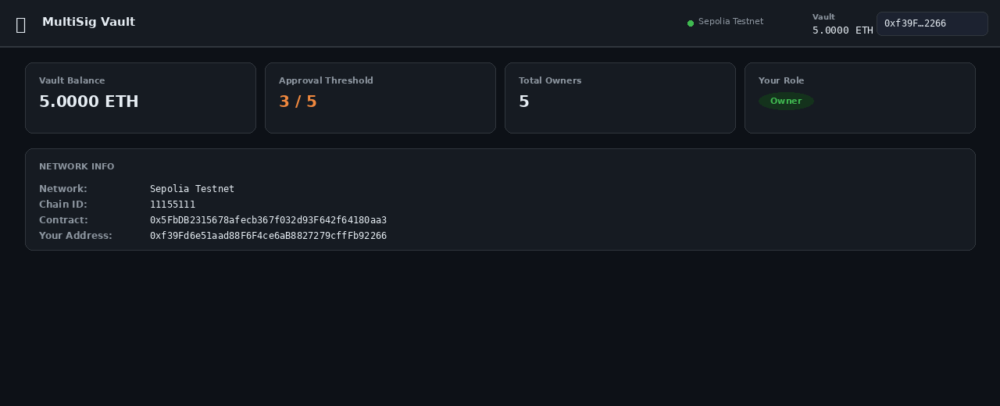

# 🔐 MultiSig Vault — Production-Grade Multi-Signature Wallet DApp

A fully auditable, reentrancy-protected multi-signature wallet built with Solidity, Hardhat, OpenZeppelin, React + Vite, and Ethers.js.

---

## Screenshots

### 1. Connect Screen
> Landing page shown before MetaMask is connected.



---

### 2. Dashboard — Wallet Info & Owners
> After connecting, the dashboard shows vault balance, threshold, owner list, and your role.



---

### 3. Submit Transaction Form
> Owners fill in a destination address, ETH value, and optional call data. Inline validation highlights errors before submission.



---

### 4. Pending Transactions Table
> All pending transactions with animated approval progress bars. Owners can Approve, Revoke, or Execute (once threshold is met).



---

### 5. Transaction History
> Executed transactions are moved to the History tab, shown with dimmed styling and a green "Executed" badge.



---

### 6. Toast Notifications
> Non-blocking toast overlays confirm every on-chain action — info (waiting), success (confirmed), and error (failed).



---

### 7. Network Info (Sepolia Testnet)
> The same DApp running on Sepolia testnet with 5 owners and a 3-of-5 threshold.



---

## Architecture Diagram

```mermaid
graph TB
    subgraph Frontend ["Frontend (React + Vite)"]
        UI["UI Components\n(Header, WalletInfo,\nSubmitForm, TxTable)"]
        Hook["useWallet Hook\n(ethers.js)"]
        ABI["ABI / Deployments\n(JSON)"]
    end

    subgraph MetaMask ["MetaMask / Browser Wallet"]
        MM["BrowserProvider\nSigner"]
    end

    subgraph Blockchain ["EVM Blockchain"]
        subgraph Contract ["MultiSigWallet.sol"]
            State["State\n(owners, required,\ntransactions[], approved[])"]
            Fns["Functions\n(submit, approve,\nrevoke, execute)"]
            Events["Events\n(Deposit, Submit,\nApprove, Revoke,\nExecute)"]
            Guard["Guards\n(onlyOwner,\ntxExists,\nnotExecuted,\nnotApproved)"]
            OZ["OpenZeppelin\nReentrancyGuard"]
        end
    end

    UI -->|calls| Hook
    Hook -->|reads| ABI
    Hook <-->|eth_requestAccounts\neth_sendTransaction| MM
    MM <-->|JSON-RPC| Blockchain
    Contract --> Events
    Events -->|contract.on()| Hook
    Hook -->|setState| UI
    OZ --> Fns
    Guard --> Fns
    Fns <--> State
```

---

## Folder Structure

```
multisig-wallet/
├── contracts/
│   └── MultiSigWallet.sol        # Main contract (ReentrancyGuard, CEI pattern)
├── scripts/
│   └── deploy.js                 # Deploy + write ABI/address to frontend
├── test/
│   └── MultiSigWallet.test.js    # 31 tests: happy path, edge cases, security
├── docs/
│   └── screenshots/              # UI screenshots (this file)
│       ├── 01_connect_screen.png
│       ├── 02_dashboard.png
│       ├── 03_submit_form.png
│       ├── 04_pending_transactions.png
│       ├── 05_transaction_history.png
│       ├── 06_toast_notifications.png
│       └── 07_network_info.png
├── frontend/
│   ├── index.html
│   ├── vite.config.js
│   ├── package.json
│   └── src/
│       ├── main.jsx              # React entry point
│       ├── App.jsx               # Root component + tab routing
│       ├── styles.css            # Complete design system
│       ├── abi/
│       │   ├── MultiSigWallet.json   # Contract ABI (auto-generated by deploy)
│       │   └── deployments.json      # Address per chainId (auto-generated)
│       ├── components/
│       │   ├── Header.jsx        # Sticky nav: account, network, balance
│       │   ├── WalletInfo.jsx    # Stats row + owners list
│       │   ├── SubmitForm.jsx    # Submit transaction form with validation
│       │   ├── TransactionTable.jsx  # Pending + history tables with actions
│       │   └── Toast.jsx         # Toast notification overlay
│       ├── hooks/
│       │   └── useWallet.js      # All blockchain interactions (single source of truth)
│       └── utils/
│           └── format.js         # Address/ETH/data formatting helpers
├── hardhat.config.js             # Hardhat + Solidity + network config
├── package.json                  # Root: hardhat scripts
├── .env.example                  # Template for secrets
├── .gitignore
└── README.md
```

---

## Smart Contract Features

| Feature | Implementation |
|---|---|
| Multiple owners | `address[] owners` + `mapping isOwner` |
| Configurable threshold | `uint256 required` set at deploy time |
| Submit transaction | `submitTransaction(to, value, data)` |
| Approve transaction | `approveTransaction(txIndex)` |
| Revoke approval | `revokeApproval(txIndex)` |
| Execute transaction | `executeTransaction(txIndex)` |
| Reentrancy protection | `OpenZeppelin ReentrancyGuard` + CEI pattern |
| Event logging | 6 events covering all state changes |
| Access control | `onlyOwner` modifier on all write functions |
| Pagination | `getTransactions(from, to)` |
| Double-execution guard | `notExecuted` modifier + flag set before call |
| Gas safety | Max 50 owners; `numApprovals` counter avoids O(n) loops |

### Security Properties

- **Checks-Effects-Interactions**: `executed = true` is set *before* the external `.call`, preventing reentrancy even without the guard.
- **ReentrancyGuard**: Belt-and-suspenders protection on `executeTransaction`.
- **Low-level `.call`**: Used instead of `.transfer`/`.send` to avoid gas stipend issues on future EVM upgrades.
- **Execution retry**: If the `.call` reverts (e.g., insufficient balance), `executed` is reset so the transaction can be retried.
- **No owner management post-deploy**: Owner set is immutable, eliminating a whole class of governance attacks.

---

## Installation

### Prerequisites

- Node.js ≥ 18
- npm ≥ 9
- MetaMask browser extension

### 1. Clone & install

```bash
git clone https://github.com/yourname/multisig-wallet.git
cd multisig-wallet

# Install Hardhat dependencies
npm install

# Install frontend dependencies
cd frontend && npm install && cd ..
```

### 2. Configure environment

```bash
cp .env.example .env
# Edit .env with your RPC URLs and private key
```

---

## Local Development

### Start a local Hardhat node

```bash
npm run node
# Starts JSON-RPC at http://127.0.0.1:8545, prints 20 funded accounts
```

### Compile the contract

```bash
npm run compile
```

### Deploy locally

```bash
npm run deploy:local
# Deploys with first 3 Hardhat accounts as owners, threshold = 2
# Writes ABI + address to frontend/src/abi/
```

### Run the frontend

```bash
npm run frontend:dev
# Opens http://localhost:3000
```

**Connect MetaMask** to `http://localhost:3000` using the Hardhat network:
- Network: `http://127.0.0.1:8545`
- Chain ID: `31337`
- Import one of the Hardhat private keys shown in the terminal.

---

## Running Tests

```bash
# All tests
npm test

# With gas report
npm run test:gas

# Coverage report
npm run coverage
```

Expected output:
```
MultiSigWallet
  Deployment
    ✓ sets owners correctly
    ✓ sets required correctly
    ✓ marks all addresses as owners
    ✓ reverts with no owners
    ✓ reverts with required = 0
    ✓ reverts when required > owners
    ✓ reverts with duplicate owners
    ✓ reverts with zero address owner
    ✓ reverts with more than 50 owners
  Deposit
    ✓ accepts ETH and emits Deposit event
    ✓ updates balance after deposit
  submitTransaction
    ✓ owner can submit a transaction
    ✓ non-owner cannot submit
    ✓ reverts when destination is zero address
    ✓ stores transaction data correctly
  approveTransaction
    ✓ owner can approve a pending transaction
    ✓ non-owner cannot approve
    ✓ cannot double-approve
    ✓ reverts for non-existent transaction
  revokeApproval
    ✓ owner can revoke their approval
    ✓ reverts if not previously approved
  executeTransaction
    ✓ executes when threshold is met
    ✓ reverts when below threshold
    ✓ cannot execute twice
    ✓ non-owner cannot execute
    ✓ reverts when wallet lacks funds
  Full happy-path flow
    ✓ submit → approve × 2 → execute transfers ETH correctly
  Security
    ✓ revoke prevents execution below threshold
    ✓ cannot approve an already-executed transaction
    ✓ handles contract interaction (call data) correctly
    ✓ pagination getTransactions works correctly

  31 passing
```

---

## Deployment to Testnet (Sepolia)

### 1. Fund your deployer wallet

Get Sepolia ETH from https://sepoliafaucet.com

### 2. Set environment variables

```bash
# .env
SEPOLIA_RPC_URL=https://eth-sepolia.g.alchemy.com/v2/YOUR_KEY
PRIVATE_KEY=your_deployer_private_key
OWNERS=0xOwner1,0xOwner2,0xOwner3
REQUIRED=2
```

### 3. Deploy

```bash
npm run deploy:sepolia
```

### 4. Verify on Etherscan

```bash
npx hardhat verify --network sepolia DEPLOYED_ADDRESS \
  '["0xOwner1","0xOwner2","0xOwner3"]' 2
```

### 5. Build and serve frontend

```bash
npm run frontend:build
# Serve dist/ with any static host (Vercel, Netlify, IPFS)
```

---

## How to Use the DApp

1. **Connect MetaMask** — click "Connect Wallet", approve in MetaMask.
2. **Fund the vault** — send ETH directly to the contract address.
3. **Submit a transaction** — fill in destination, ETH amount, and optional call data, then click "Submit Transaction".
4. **Approve** — other owners visit the DApp and click "Approve" on pending transactions.
5. **Execute** — once the approval threshold is reached, any owner can click "Execute".
6. **Revoke** — owners can change their mind and click "Revoke" before execution.

---

## Frontend Features

| Feature | Component |
|---|---|
| Connect Wallet | `Header.jsx` + `useWallet.js` |
| Display owners | `WalletInfo.jsx` |
| Display threshold | `WalletInfo.jsx` |
| Vault balance | `Header.jsx` + `WalletInfo.jsx` |
| Submit transaction form | `SubmitForm.jsx` (with validation) |
| Pending transactions table | `TransactionTable.jsx` |
| Approve / Revoke buttons | `TransactionTable.jsx` |
| Execute button | `TransactionTable.jsx` |
| Approval progress bar | `TransactionTable.jsx` |
| Transaction history | Tab in `App.jsx` |
| Toast notifications | `Toast.jsx` |
| Live contract event sync | `useWallet.js` |
| MetaMask account/chain listeners | `useWallet.js` |

---

## Contributing

1. Fork the repo
2. Create a feature branch: `git checkout -b feat/my-feature`
3. Write tests for new functionality
4. Open a pull request

---

## License

MIT
